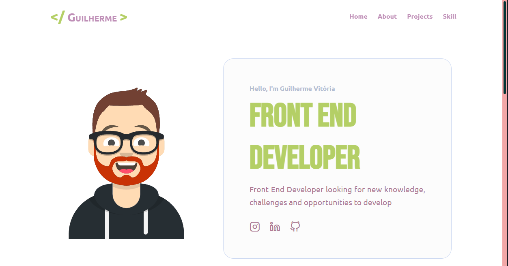

# GLSVITORIA Website

  

## Um pouco do Projeto:

➡ Meu site próprio para poder divulgar meu projetos, falar um pouco sobre mim e tudo em um lugar só

## Conteúdos

- [Overview](#overview)
  - [Como rodar o projeto](#como-rodar-o-projeto)
  - [Screenshot](#screenshot)
  - [Links](#links)
- [Processo](#processo)
  - [Tecnologia utilizadas](#tecnologias-utilizadas)
  - [Continuação do desenvolvimento](#continuacao-do-desenvolvimento)
- [Autor](#autor)

## Overview

### Como rodar o projeto

 1. Primeiramente é necessário ter o node js instalado(caso não tenha, apenas baixe a pasta zip do projeto) 
 2. Clone o projeto com `git clone https://github.com/glsvitoria/my_site`
 3. Após clonar o projeto, basta apenas abrir o html principal do site e utilizar as suas funcionalidades

### Screenshot

### Links
- Site hospedado: [Glsvitoria Website](https://glsvitoria.github.io/my_site/)

## Processo

### Tecnologias utilizadas:

### Continuação do desenvolvimento
  - Manter a navegação fixa no topo da tela
  - Botão para subir ao topo do site
  - Seção de projetos
  - Linkar navbar com site
  - Tornar o site totalmente responsivo

## Autor
- Linkedin - [Guilherme Vitória](https://www.linkedin.com/in/glsvitoria/)
- GitHub - [glsvitoria](https://github.com/glsvitoria)
- Instagram - [glsvitoria](https://www.instagram.com/glsvitoria/)
